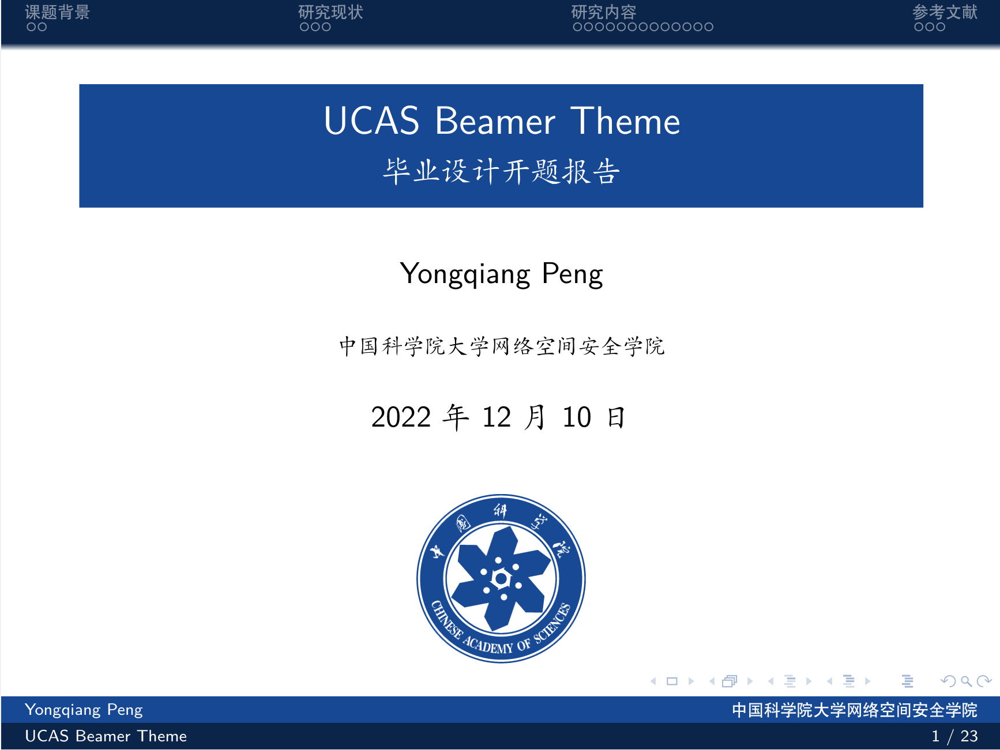
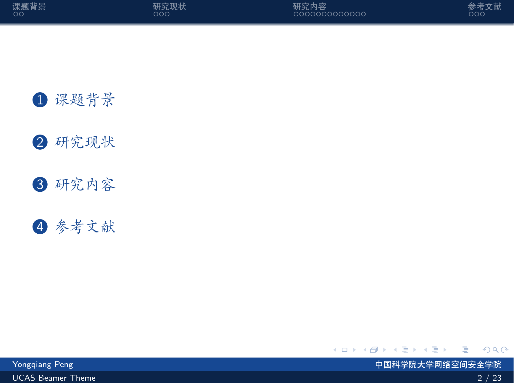
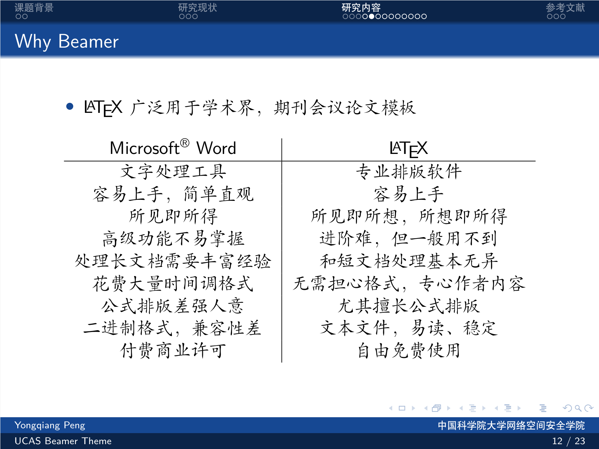
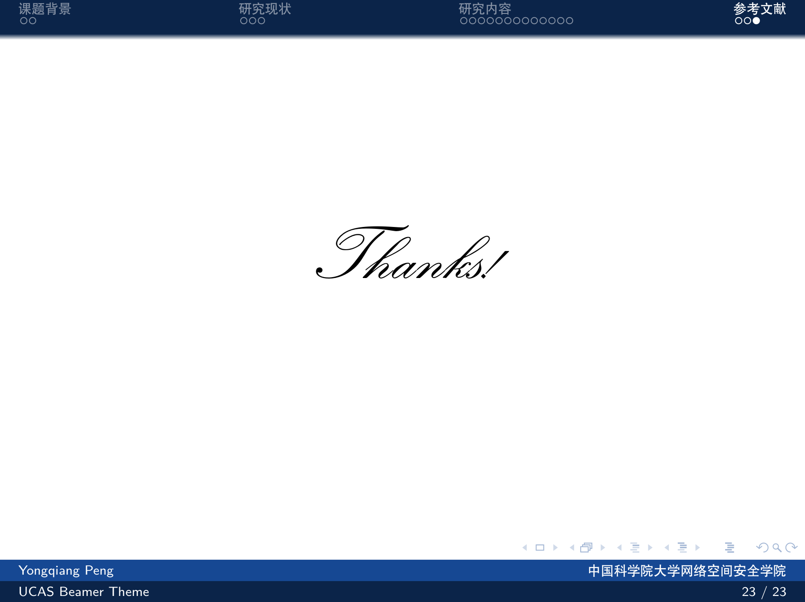

# UCAS-Beamer-Theme

 **A Beamer Theme of UCAS for academic report, thesis and talk.**

## Introduction

- 基于[THU-Beamer-Theme](https://github.com/tuna/THU-Beamer-Theme)进行修改，仅修改配色和校徽，如有更多需求，可自行修改sty文件

- 改完发现已经有学长改过了orz，加上了研究所的logo，[Overleaf模板地址](https://www.overleaf.com/latex/templates/ucas-casia-beamer-theme/stdydfhvkctw)

## Beamer Image

